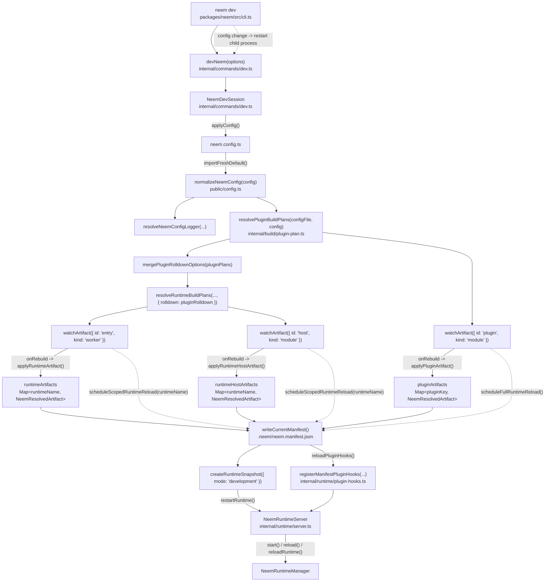
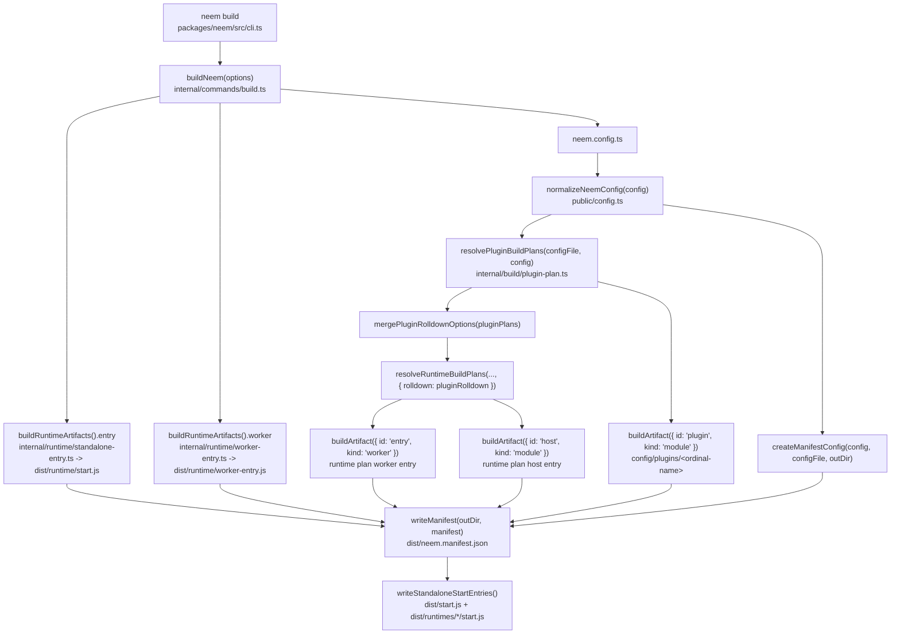
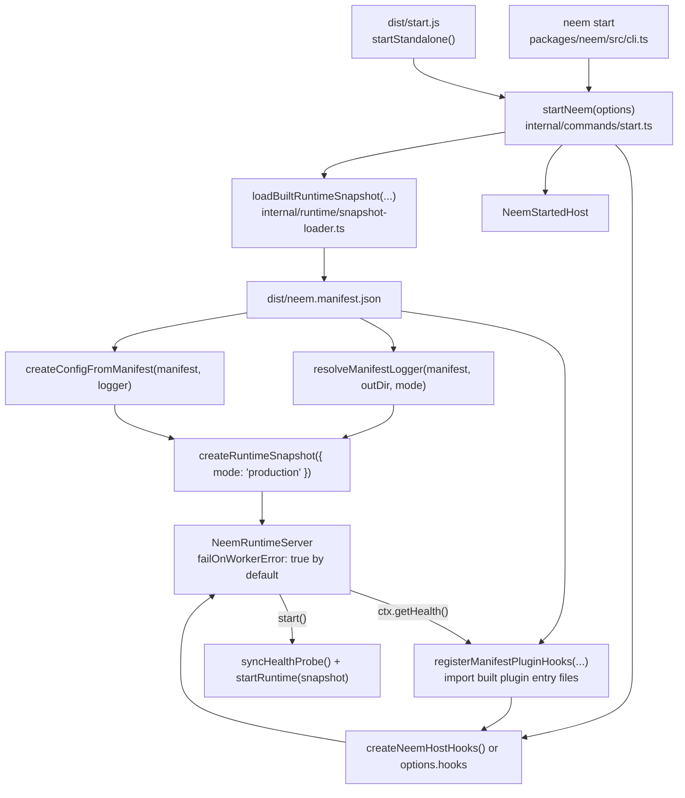
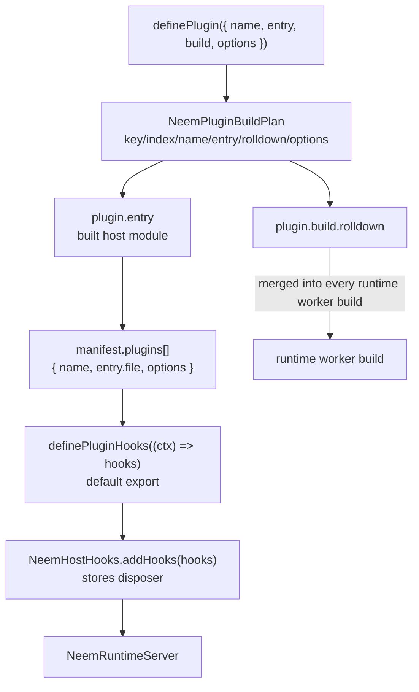
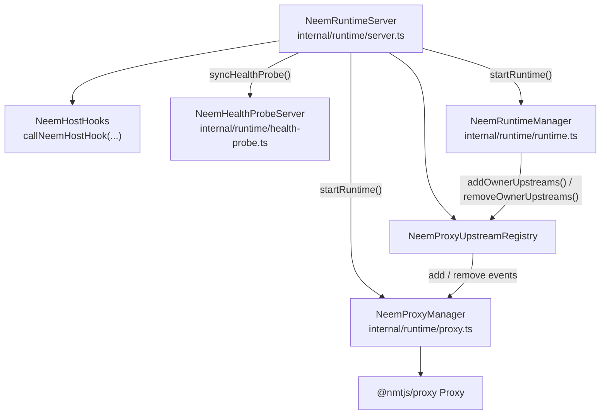
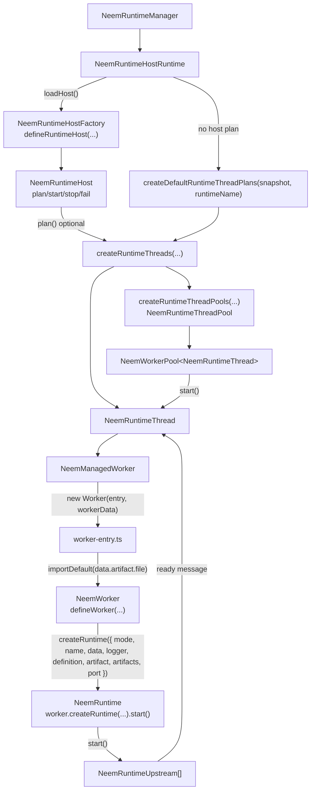
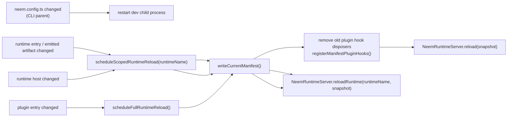

# Neem Architecture

This doc names components as they appear in `packages/neem`.

## Dev

`neem dev` builds watched runtime artifacts into `.neem`, writes a
`NeemBuildManifest`, then starts the same runtime server used by production.
The CLI parent owns config-file watching and restarts the dev child process on
config changes. Inside one child process, `devNeem` imports config once; runtime
and plugin entry source rebuilds reload the server.

## Prod Build

`neem build` writes `dist/runtime/start.js`, `dist/runtime/worker-entry.js`,
runtime `entry` artifacts, optional runtime `host` artifacts, optional plugin
entry artifacts, and `dist/neem.manifest.json`. Plugin build Rolldown options
are merged into every runtime worker build before runtime-local Rolldown.

## Prod Start

`neem start` and generated `dist/start.js` both go through `startNeem`.
`startNeem` loads built metadata, creates a `NeemRuntimeSnapshot`, registers
built plugin hooks from manifest order, then starts `NeemRuntimeServer`.
Production never imports original `neem.config.ts`.

## Plugins

Neem plugins are host/build extensions, not runtimes. `neem.config.ts` can
declare ordered `plugins`. Each plugin may provide build Rolldown options,
a host-side `entry`, both, or neither. Duplicate plugin names are allowed;
`name` is diagnostic, while ordinal keys like `000-metrics` make output paths
stable.

## Runtime Server

Dev and prod converge here. `NeemRuntimeServer` owns server state, runtime
manager, proxy manager, health probe, proxy upstream registry, and host hooks.

## Runtime Internals

Each configured runtime becomes one `NeemRuntimeHostRuntime`. Host code can
provide a custom `plan()`. Without host plan, Neem creates default
`NeemRuntimeThreadPlan` values from `runtimeConfig.threads`.

## Reload Paths

